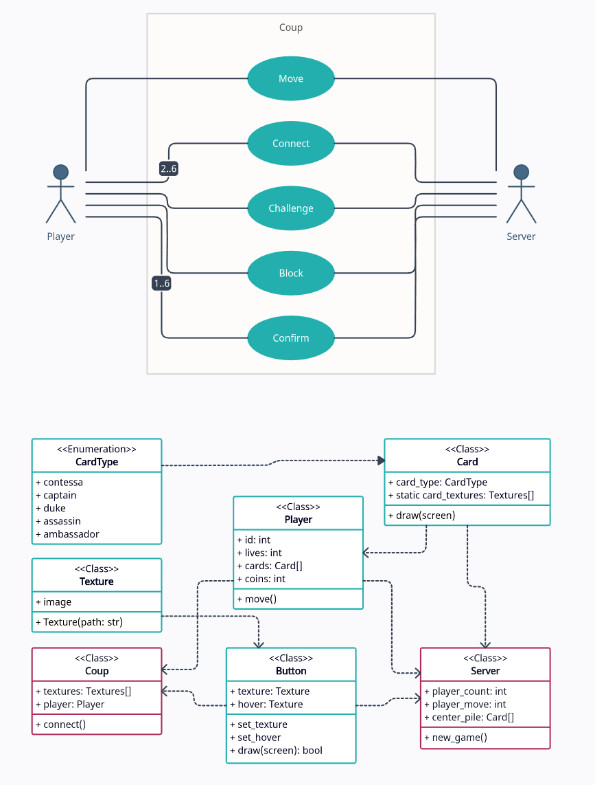

# Python project 2 - Coup
Name: [Kirill Zolotuskiy](https://github.com/Kirill-iceland)  
Group: `Б05-327`  

## Description
An online version of popular game named [Coup](https://boardgamegeek.com/boardgame/131357/coup). 
The project will provide a way for a group of people to play together.

## Uses
- Create server
- Play the game on that server

## UML diagram

